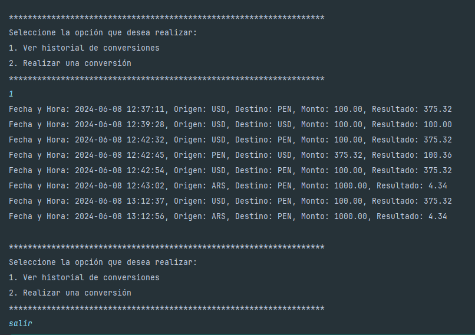

# challengeConversorOracleEdu

## Descripción
Este proyecto es una aplicación de conversión de monedas desarrollada como parte de un desafío educativo de Oracle. La aplicación permite a los usuarios convertir montos entre diferentes monedas y registrar las conversiones realizadas en un archivo de texto.

## Características
- Conversión de monedas en tiempo real utilizando una API externa.
- Registro de conversiones en un archivo de texto.
- Visualización del historial de conversiones.
- Interfaz de usuario en consola.

## Tecnologías Utilizadas
- Java
- API de conversión de monedas: Exchange Rate API
- Biblioteca estándar de Java para E/S

## Estructura del Proyecto
```
challengeConversorOracleEdu/
├── src/
│   ├── Main.java
│   ├── Monedas.java
│   ├── ConsultaMoneda.java
│   ├── RegistroConversion.java
│   ├── MonedaDTO.java
│   └── MonedaConversion.java
├── conversiones.txt
├── README.md
└── .gitignore
```

## Instrucciones de Instalación
1. Clona este repositorio en tu máquina local:
   ```bash
   git clone https://github.com/jascmen/challengeConversorOracleEdu.git
   ```
2. Navega al directorio del proyecto:
   ```bash
   cd challengeConversorOracleEdu
   ```
3. Asegúrate de tener [Java Development Kit (JDK)](https://www.oracle.com/java/technologies/javase-downloads.html) instalado en tu sistema.

## Cómo Ejecutar la Aplicación
1. Compila los archivos Java:
   ```bash
   javac src/*.java
   ```
2. Ejecuta la aplicación:
   ```bash
   java src/Main
   ```

## Uso
- **Ver historial de conversiones**: Selecciona la opción 1 para ver el historial de conversiones guardadas.
- **Realizar una conversión**: Selecciona la opción 2 para realizar una conversión de monedas.
  - Selecciona la moneda de origen.
  - Ingresa el monto a convertir.
  - Selecciona la moneda de destino.
  - La aplicación mostrará el resultado de la conversión y guardará la información en `conversiones.txt`.

## Ejemplo de Ejecución
```
Bienvenido a la aplicación de conversión de monedas
Para salir en cualquier momento escriba 'salir'

*******************************************************************
Seleccione la opción que desea realizar:
1. Ver historial de conversiones
2. Realizar una conversión
*******************************************************************
2
*******************************************************************
Por favor seleccione la moneda de origen
1. USD
2. EUR
3. GBP
*******************************************************************
1
Por favor ingrese el monto a convertir
100
*******************************************************************
Por favor seleccione la moneda de destino
1. USD
2. EUR
3. GBP
*******************************************************************
2
Resultado de la conversión: 100.00 USD = 85.00 EUR
```
## Capturas de Pantalla




## Contacto
Para cualquier consulta o sugerencia, por favor contacta a [jascmen@gmail.com](mailto:tu_email@example.com).
